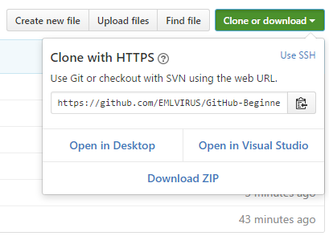
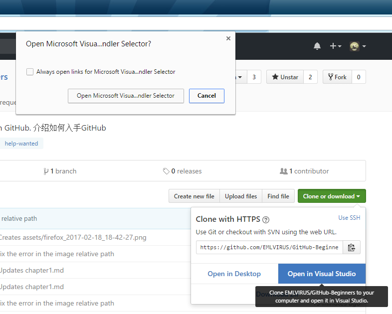

在克隆菜单之中可以看见，有三个按钮：

1. **Open in Desktop**: 使用Github Desktop客户端打开
2. **Open in Visual Studio**: 使用VisualStudio之中内置的官方Github客户端打开
3. **Download ZIP**: 仅下载当前分支的源代码包

在这里我们将会详细介绍如何使用VisualStudio进行Github上面的repository的克隆操作。

当我们点击了``Open in Visual Studio``这个按钮之后，浏览器将会弹出一个URL Protocol的对话框，提示我们是否允许Github网站启动Visual Studio程序。在这里为了能够使用VisualStudio进行repository的克隆操作，这里选择从浏览器弹出来的对话框之中的左边的按钮，``Open Microsoft Visual Studio Github Handler Selector``进行授权。

