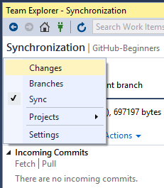

## 使用VisualStudio进行repository的修改的commit以及同步操作

不像svn管理系统，commit是直接commit到中心服务器之上的，故而svn的commit操作必须要保证客户端和服务器是处于联网状态的。对于git源代码管理而言，则可以先将代码commit到本地的repository之中，然后在push到服务器上面的时候才会需要联网。

|   |          Local           |           Remote          |
|---|--------------------------|---------------------------|
|svn|                          |[local] commit --> [remote]|
|git|[local] commit --> [local]|[local] sync  <--> [remote]|

使用VisualStudio之中的github客户端进行源代码的保存操作大致需要经过两个主要步骤：

+ **local commit**, 本地提交
+ **sync with remote**, 与远程仓库同步

通过点击

通过点击在GitHub客户端上面的repository的名称标签，将会打开一个菜单，例如：

+ **Changes**: 修改更新的本地提交
+ **Branches**: 切换源代码的分支
+ **Sync**: 与远程服务器的同步操作
+ **Projects**: 在不同的repository之间进行工作区切换
+ **Settings**: Github账号设置以及当前的repository设置