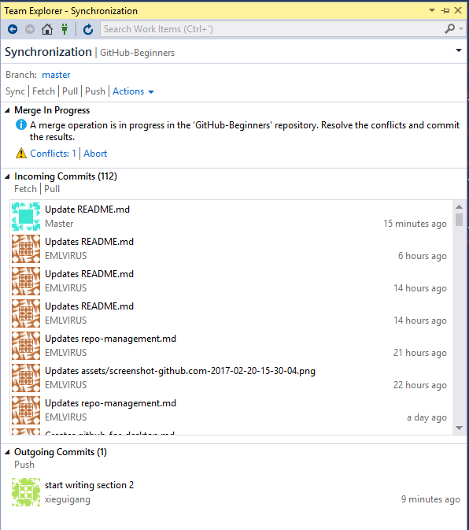

## 如何使用VisualStudio解决团队开发过程之中的commit冲突

当两个人同时修改同一份文档之中的同一处位置的时候，git程序将会无法自动为我们执行代码源文件的合并操作。例如，在编写``GitHub 新手入门``这份文档的时候就出现了commit合并冲突：

可以很明显的了解到，在上面的commit合并的过程之中出现了一个合并冲突(**Conflicts: 1**)，github客户端给了我们两个选择：

+ **Conflicts: 1**: 解决这个合并过程之中的commit冲突
+ **Abort**: 放弃合并操作