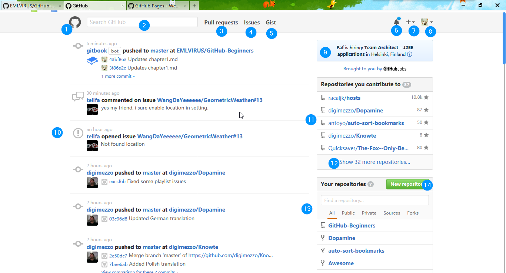
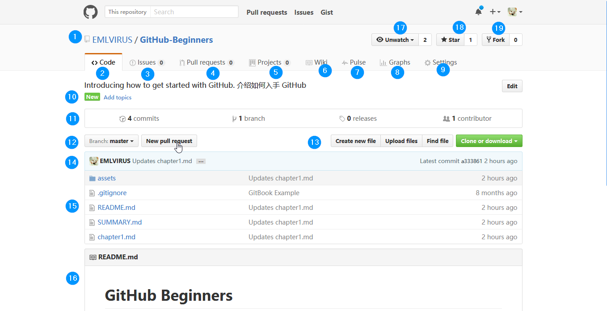

# UI简介  UI Introduction

此处介绍GitHub UI及其作用.

Here introduces UI on GitHub and how it works.

#### 登陆后主页UI如下 Here is home page UI after login

###### 请注意：顶部导航栏部分已被GitHub默认修改为黑色，如需达到截图中的白色效果请参考[这一CSS脚本](https://userstyles.org/styles/138766/github-return-light-themed-header)效果. 如不清楚如何使用，参考[这里](https://userstyles.org/help/stylish)。

###### Note: The top header is set to black by default, refer [this CSS script](https://userstyles.org/styles/138766/github-return-light-themed-header) if white one requied as the sreenshot above. Click [here](https://userstyles.org/help/stylish) if you don't know how to apply with it.

①主页按钮：点击返回GitHub主页  Home page button: click to return home page

②搜索框：全站搜索任意项目repository、代码code、代码提交commit、议题issue、介绍文档wiki、用户users；在项目主页（下图）中搜索即会限制为当前项目搜索

②search box: search any repository, code, commit, issue, wiki, users at whole site level; search in repo home page \(see sreenshot below\) will set to your repo level

③④快速访问与你相关的提交请求pull request跟议题issue

③④quick acess to pull requests and issues relevant to you

⑤访问GitHub Gist服务（快速代码白板与分享）  acess GitHub Gist \(code scratchpad and share\)

⑥通知按钮：点击查看所有与你相关的通知。如你已收到新通知，按钮右上角会出现图中蓝点

⑥noticification button: click to see all noticifications relevant to you. There will the blue spot as the screenshot above if there is new one.

⑦新建按钮：点击可以新建项目（等效于⑭）、导入项目、新的Gist、新建组织。**在属于你的项目主页中**还可以新建issue或者邀请合作人collaborator

⑦new button: click to create a new repo \(equal to ⑭\), import a repo, new Gist or a new organization. Click this** in your repo home page** to create a new issue or invite a new collaborator

⑧账户相关操作，包含：账户信息Your profile、你收藏的项目Your stars、探索GitHub Explore、GitHub服务集成Integrations、官方帮助站点Help、账户设置Settings、登出Sign out

⑧account relavant operations, including: your profile, your stars, Explore, Integrations, Help, Settings, Sign out

⑨GitHub官方通知 noticifications from GitHub

⑩通知详情，展示关于你关注的人或项目的_**公开**_详情 noticifications about_** open**_ details about people you follow or repo your watch

⑪显示你有贡献（新建或讨论相关issue或提交过代码）的项目，点击⑫展开

⑪display all repos you contributed to \(created new or commented on issues or created pull request\), click ⑫ to expand

⑬展示属于你的项目 display all your repos

⑭新建项目按钮 new repo button

#### 项目主页UI如下 Here is repository UI

①项目所有人跟标题 repo owner and name

②代码详情（此页为项目主页）code details \(also repo home page\)

③项目相关议题issue in this repo

④代码提交请求open pull request

⑤项目工程project（利于团队合作）new project \(for team work\)

⑥项目文档wiki

⑦⑧将项目活动以图标形式显示 graphs to display repo activities

⑨设置，仅在属于你的项目中可见 settings, only visible in your repo

⑩项目描述；点击右侧Edit按钮编辑；点击new topics添加项目主题标签 repo descriptions

⑪点击分别显示提交详情commits 分支branch 版本发布release 贡献人contributor

⑫查看每一分支代码详情或就_**当前分支**_提出提交请求pull request    view details on every branch or create new pull request on _**current branch**_

⑬新建、上传、查找文件，或将当前项目源代码打包下载或者在桌面打开（需要安装GitHub for desktop）open in desktop

⑭该项目最新提交的提交人、内容、时间及代号 last commit info

⑮文件列表，点击查看源代码   files list, click to see source code

⑯项目须知readme

⑰watch关注这一项目所有活动，再次点击取消 watch all activities in this repo, click again to cancel

⑱star项目收藏，再次点击取消 stargerize this repo, click again to cancel

⑲fork新建属于你的项目副本（与主项目_**不自动同步**_） fork this repo \(will **NOT **sync with the original repo\)

